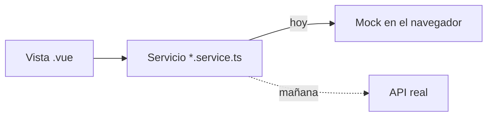

# KM.Restaurante · Mesa

[](https://github.com/Kreyshin/KM.WEB.RESTAURANT/actions/workflows/pages.yml)

Back office para negocios gastronómicos: salones, mesas, carta, inventario, personal, ventas, comprobantes y reportes. **Un sistema Karma Corp.**

| | |
| --- | --- |
| 🖥️ **Demo** | [kreyshin.github.io/KM.WEB.RESTAURANT/demo](https://kreyshin.github.io/KM.WEB.RESTAURANT/demo/) |
| 📚 **Documentación** | [kreyshin.github.io/KM.WEB.RESTAURANT](https://kreyshin.github.io/KM.WEB.RESTAURANT/) |

> En la demo el acceso viene precargado y acepta cualquier contraseña. Los datos viven en tu navegador y se reinician desde **Perfil → Datos de ejemplo**.

## Enfoque: front primero

El back office se construye completo **sobre datos de ejemplo**, antes que el backend. La regla que lo hace posible:



- Las vistas **nunca** leen datos directamente: siempre llaman a un servicio.
- Cambiar el mock por la API solo toca el servicio; las vistas no cambian.
- Los tipos de `src/types` son el borrador del **modelo de datos** del backend.

## Stack

Vue 3 + TypeScript · Vite · Pinia · Vue Router · Tailwind CSS v4 · Vitest · Testing Library · Playwright · VitePress

## Empezar

Requisitos: **Node 24** o superior.

```bash
cd backoffice
npm install
npm run dev        # app en http://localhost:5173
npm run docs:dev   # documentación en local
```

| Script | Qué hace |
| --- | --- |
| `npm run dev` | Servidor de desarrollo |
| `npm run verify` | Formato, lint, tipos, pruebas unitarias y de componente. **Debe pasar antes de cada commit** |
| `npm run test:e2e` | Pruebas end-to-end con Playwright (`test:e2e:ui` para verlas paso a paso) |
| `npm run build` | Build de producción |
| `npm run build:demo` | Build de la demo para GitHub Pages |
| `npm run docs:build` | Build de la documentación |

## Estructura

```text
.
├─ .github/workflows/pages.yml   Publica docs y demo en GitHub Pages
└─ backoffice/
   ├─ docs/                      Documentación (VitePress)
   └─ src/
      ├─ components/ui/          Componentes base Km*
      ├─ components/layout/      Shell: barra, menú, cabecera, buscador
      ├─ composables/            useListado
      ├─ services/               Contrato de datos (+ mock/)
      ├─ stores/                 Pinia: sesión, tema, local
      ├─ types/                  Modelo de dominio
      └─ views/                  Una carpeta por módulo
```

## Estado

| Fase | Objetivo | Estado |
| --- | --- | --- |
| F0 · Higiene | Git, lint, formato, pruebas | ✅ |
| F1 · Cimientos | Componentes y capa de datos mock | ✅ |
| F2 · Configuración | Empresa, locales, impuestos, pagos, series | ✅ |
| F3–F6 · Maestros | Sala y carta, inventario, personal, clientes | 🚧 |
| F7–F8 · Operación | Ventas, caja y comprobantes | ⏳ |
| F9–F10 · Análisis | Reportes, pulido y entidades | ⏳ |

Detalle en el [roadmap](https://kreyshin.github.io/KM.WEB.RESTAURANT/guia/roadmap).

## Contribuir

1. Sigue la receta de [crear un módulo nuevo](https://kreyshin.github.io/KM.WEB.RESTAURANT/guia/nuevo-modulo): tipo → semilla → servicio → vista → ruta.
2. Reutiliza los [componentes Km*](https://kreyshin.github.io/KM.WEB.RESTAURANT/componentes/) antes de crear uno nuevo.
3. Ejecuta `npm run verify` y `npm run test:e2e`. Guía: [Testing y QA](https://kreyshin.github.io/KM.WEB.RESTAURANT/guia/testing).
4. Cada push a `main` verifica y publica la documentación y la demo.

## Más información

- [Documentación completa](https://kreyshin.github.io/KM.WEB.RESTAURANT/)
- [Sistema de diseño y contrastes](backoffice/README.md)
- [Entidades del dominio](https://kreyshin.github.io/KM.WEB.RESTAURANT/guia/entidades)
